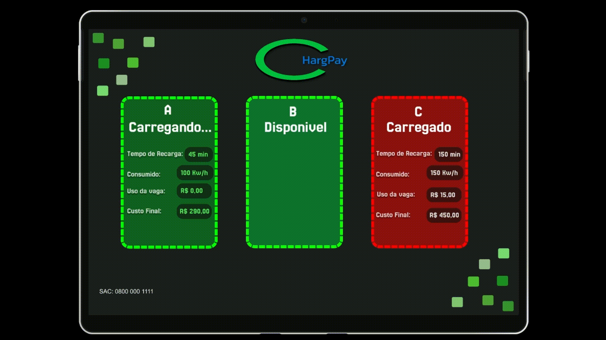

  
  
<strong>ChargPay é um software que está sendo desenvolvido para uma estação de carregamento de carros elétricos que visa oferecer totems de carregamento para estabelecimentos, públicos ou privados<strong>

    

---

  

  
